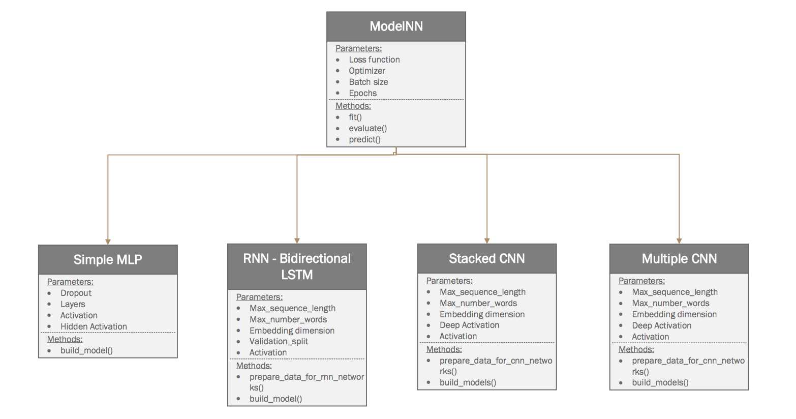

## Text classification with Neural Networks

This project implements various sentiment text classifiers using the python deep learning library: [Keras](https://keras.io/).
There are build, tuned and tested 4 neural network models:
 
 - Simple MLP
 - Stacked CNN
 - Multiple CNN
 - Bi-directional LSTM
 

### Getting started
These instructions will get you a copy of the project up and running on your local machine for development and testing purposes.

1. Install the requirements.txt
2. run the python script for each model `simple_mlp.py` or `stacked_cnn.py` or `multiple_filter_cnn.py` or `lstm.py`.

### Installing
In order to run the code in your local environment, please make sure your have python 3. and above and to have installed the needed python libraries. To install the libraries please run on your console:

```
pip install -r requirements.txt
```

### Structure

The project consists of the following main classes:




